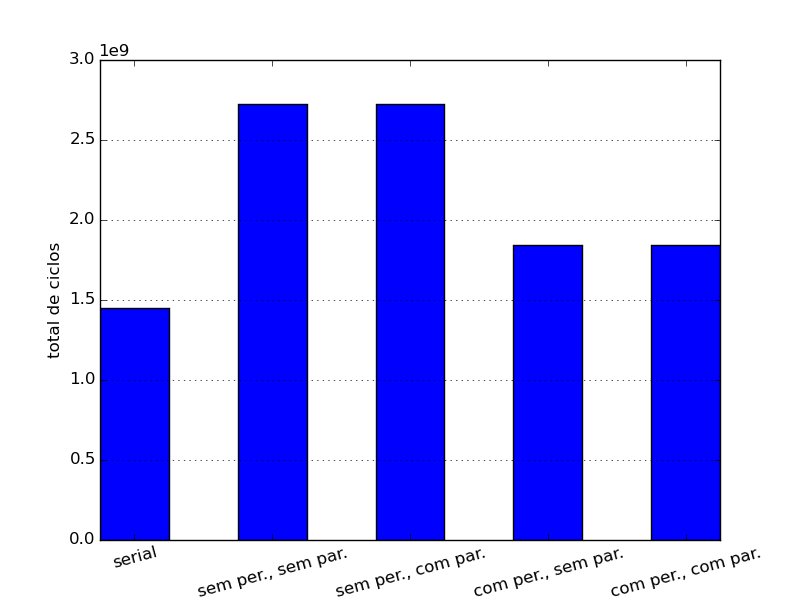
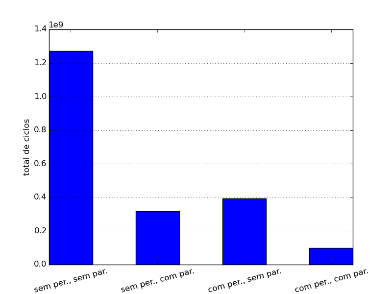
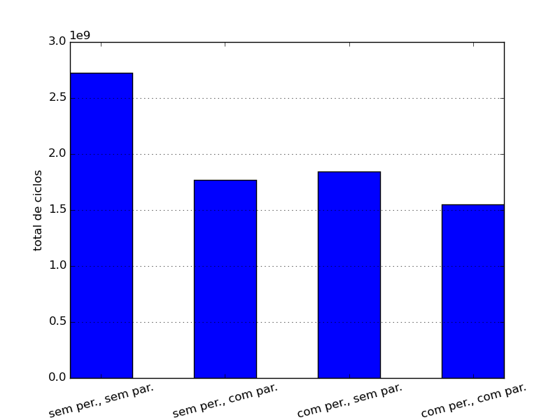

MC723a - Laboratório de Projetos de Sistemas Computacionais
====
###### 2016-07-01
#### Professor: Lucas Wanner
#### 033342 - Yugo Kuno
#### 139546 - João Lopes

Projeto 3 - Multicore e Aceleração em Hardware
====

## Objetivo
Utilizando um simulador de arquitetura _MIPS_, rodar um programa em um sistema com múltiplos cores e acesso a um periférico extra que auxilie no processamento; avaliar os ganhos de desempenho devidos ao paralelismo multicore e à aceleração devido ao periférico comparado a um sistema single-core sem acesso ao hardware extra; verificar que o resultado do programa em todas as arquiteturas é consistente.  
O simulador utilizado foi criado com a linguagem _ArchC_, desenvolvidos pelo time do IC/Unicamp de mesmo nome e baseado na linguagem de descrição de hardware _SystemC_, tendo recebido também mais contribuições por outros pesquisadores do instituto.  

## Software a ser executado
O software escolhido para testar o periférico acelerador e o paralelismo feitos no simulador é um programa que calcula os retornos de capital de investidores com diferentes montantes iniciais, taxas de retorno e períodos de investimento.  
Este é um problema extremamente relevante no contexto bancário, especialmente devido a certos tipos de investimento usarem taxas de retorno mensais mas com tempo calculado em dias de investimento, tal que a exponenciação se dá com expoentes em ponto flutuante: este é um problema não trivial para o qual geralmente só se calcula um resultado aproximado.  

Desta forma os _inputs_ do programa foram 3 arquivos contendo os [montantes iniciais](mips_multi_lock_multiplyperipheral_example/y4k_initial_capital.txt), as [taxas de retorno](mips_multi_lock_multiplyperipheral_example/y4k_monthly_interest.txt), e os [períodos de investimento](mips_multi_lock_multiplyperipheral_example/y4k_investment_time.txt). Todos são precedidos pelo número de clientes para os quais o retorno dos investimentos serão calculados, sendo dez mil investimentos neste exemplo.

Como a arquitetura de CPU utilizada foi a MIPS, operações de ponto flutuante são muito custosas visto que não existem unidades aritiméticas dedicadas para este tipo de operação; assim foi projetado um periférico que realiza as exponenciações fora da CPU. Foi discutido incluir também mais uma variável (capital inicial) a ser passada ao periférico para que ela fosse multiplicada pelo resultado da exponenciação, tal que seriam sanadas completamente as limitações da CPU com relação a estas operações de ponto flutuante. No entanto esta ideia (apesar de ser simplesmente implementável) não foi usada visto que este é um periférico dedicado para exponenciação, sendo considerada uma modificação excessivamente restrita ao cenário considerado. Assim a multiplicação do capital inicial pela taxa de retorno total continuou sendo realizado pela CPU, o que limita o ganho de performance, mas torna o periférico mais simples e de uso mais geral.  

## Periférico de aceleração e paralelismo da CPU
Um periférico de aceleração de exponenciais pode utilizar para o método de cálculo de exponenciais utilizando tabelas pré-processadas de logaritmos e exponenciais. Dessa forma, o acelerador possui uma memória do tipo read-only que permite calcular com boa precisão e boa eficiência uma exponencial em ponto flutuante. O periférico é um coprocessador de exponenciação paralela usando a metodologia de _lookup table_ de logarítimos e exponenciais na base 2; no cenário projetado este hardware foi desenvolvido especificamente para o processador deste sistema, tal que cada _core_ tem acesso exclusivo a uma unidade aritmética de exponenciação do periférico, não havendo concorrência de acesso.  
Nesta simulação foram utilizados uma CPU de quatro cores com quatro unidades correspondentes de exponenciação no periférico.  

Outra característica interessante deste periférico é que como apenas a mantissa (23 bytes do 32 totais) das variáveis de ponto flutuante será utilizada como indexador tanto da tabela de logarítimos quanto da tabela de exponenciais, cada tabela ocupará apenas 32MB de ROM.  

Desta forma o periférico realiza, independentemente para cada _core_, a exponenciação com a taxa de retorno como base e o valor do período como expoente para se obter o a taxa total de rendimento. Cada core então multiplica este resultado pelo montante inicial para obter o resultado final. Obviamente ele não foi projetado para lidar com números complexos, tal que o resultado para qualquer combinação de base negativa e expoente com parte fracional retorna um `nan`.

Resumidamente, o fluxo de dados entre cada _core_ e cada núcleo exclusivo de processamento do periférico se dá através de 3 endereços de 32 bits: _status_, _base_, e _exponent_. O _core_ escreve os valores de taxa de retorno e período de investimento em _base_ e _exponent_, então escrevendo `1` em _status_ para que aquele núcleo do periférico comece a exponenciação. Em seguida o _core_ fica em _loop_ até que o valor de _status_ mude para `0`, que é como o núcleo sinaliza que a operação foi concluída e o resultado está disponível no endereço _base_.

Na simulação o _loop_ leva apenas um ciclo, visto que o cálculo do número de ciclos gasto pelo periférico será realizado a parte a partir das considerações abaixo.

## Ciclos consumidos por cada operação do periférico
Cada operação de exponenciação emulada em ponto flutuante ocupa o surpreendentemente alto valor de ~43k ciclos, enquanto o periférico de aceleração idealmente totalizará apenas 9 ciclos na seguinte sequência de operações abaixo (onde _x_ e _y_ representam respectivamente a _base_ e _exponent_).  

|operação|descrição|ciclos|
|:---|:---|---:|
|x = sx · 2 ^ ex|separar sx (mantissa) e ex (expoente)|1|
|a = lg2(sx)|acessar tabela de logarítimos usando o valor de sx (23b)|2|
|b = lg2(x) = ex · a|multiplicação|1|
|c = lg2(x ^ y) = y · b|multiplicação|1|
|c = nc + fc|separar nc (parte inteira) e fc (parte fracionária)|1|
|d = x ^ y / 2 ^ nc = 2 ^ fc|acessar tabela de exponenciais usando o valor de fc (<= 23b)|2|
|x ^ y = d * 2 ^ nc |aumentar o valor do expoente de d em 2 ^ nc|1|

O cálculo acima assume que o acesso à pequena memória ROM do periférico consome apenas 2 ciclos e todas operações de multiplicação de ponto flutuante consomem apenas 1 ciclo.  

Considerando 4 ciclos para cada escrita/leitura feita pela CPU no periférico, chega-se então a 12 ciclos para cada input (escrita de _status_, _base_, e _exponent_), o máximo de 16 ciclos aguardando o periférico terminar (a CPU faz três leituras em que a exponenciação ainda não acabou e mais uma para verificar sucesso), e mais 4 ciclos lendo o resultado da exponenciação. Desta forma cada uma das dez mil exponenciações corresponde a 32 ciclos gastos aguardando o periférico. Na simulação, isso corresponderá a 5 instruções de _load_ por exponenciação executadas pela CPU.

## Resultados

### Consistência

Antes de mais nada é fundamental averiguar que o resultado em todas as abordagens é consistente.

O capital inicial total do dez mil investimentos (com valores individuais entre $100 e $500,000) avaliados é de $2,471,685,888; o resultado total dos mesmos (com taxas de retorno entre 0.1% e 1% e períodos entre 1 e 36 meses), foi calculado em $2,743,482,624. Isso representa cerca de 11% de rentabilidade total, o que está dentro do esperado para os valores utilizados.  
É claro que esses valores foram checados em outros programas e todos os resultados globais são consistentes entre as diferentes arquiteturas.

Entretanto, mesmo o valor final sendo o esperado, curiosamente há algumas (poucas) divergências de centavos espalhadas entre os valores finais de investimentos individuais nas abordagens que utilizam o periférico ([y4k_result_1per0par.txt](mips_multi_lock_multiplyperipheral_example/y4k_result_1per0par.txt) e [y4k_result_1per1par.txt](mips_multi_lock_multiplyperipheral_example/y4k_result_1per1par.txt)) e nas abordagens que não o utilizam ([y4k_result_0per0par.txt](mips_multi_lock_multiplyperipheral_example/y4k_result_0per0par.txt) e [y4k_result_0per1par.txt](mips_multi_lock_multiplyperipheral_example/y4k_result_0per1par.txt)). O primeiro exemplo dessa divergência ocorre no oitavo resultado de cada arquivo, em qual a diferença é de 4 centavos em um total de mais de $400,000.  

Em todas as simulações de arquitetura foi utilizada a função `pow` da biblioteca `math.h`, entretanto nos casos sem o periférico a operação é adaptada para a arquitetura MIPS que não dispõem de unidades aritméticas para operações com ponto flutuante: acredita-se que essa é a fonte da divergência. De fato as abordagens com o periférico geram o resultado mais próximo do valor correto, mas mesmo assim o valor ainda não é o correto. Esta imprecisão se deve pelo uso de `floats`, que são representados apenas com 32 bits divididos entre mantissa e expoente, tal que a precisão será necessáriamente limitada. Idealmente seriam utilizados `doubles` para esta categoria de problema, mas como a simulação parte da arquitetura MIPS, aumentaria-se ainda mais a complexidade da simulação utilizar este tipo de variável, quando os objetivos de estudo de arquitetura já estão sendo suficientemente atigidos com o uso de `floats`; assim considera-se que as diferentes abordagens são suficientemente consistentes e sem bugs óbvios de implementação.  

### Performance

Nas tabelas abaixo, foram considerados 10 ciclos por instrução de acesso à memória propriamente dita, 3 ciclos por instrução de _jump_/_branch_ e 1 ciclo para outros tipos; as contagens para estes três tipos de instruções não consideram aquelas utilizadas para interagir com o periférico, que são analisadas separadamente (como descrito acima) considerando 32 ciclos para cada uma das dez mil operações de exponenciação.  

#### Contagem total de ciclos, somando o número de ciclos consumidos pelos quatro _cores_

| |serial, sem exponenciações|sem periférico, sem paralelismo|sem periférico, com paralelismo|com periférico, sem paralelismo|com periférico, com paralelismo|
|:---|---:|---:|---:|---:|---:|
|acessos a memória|98,022,228|182,190,800|182,188,449|125,303,577|125,291,700|
|_jumps_/_branchs_|86,981,211|148,349,401|148,347,044|104,678,496|104,676,592|
|outras instruções|210,422,677|456,224,761|456,220,053|278,718,624|278,714,838|
|ciclos em instruções de CPU|1,451,588,590|2,723,180,964|2,723,145,675|1,845,789,882|1,845,661,614|
|ciclos interagindo com o periférico|0|0|0|320,000|320,000|
|total de ciclos|1,451,588,590|2,723,180,964|2,723,145,675|1,846,109,882|1,845,981,614|

A primeira coluna se refere a uma execução do programa exatamente igual às demais, exceto que não se realiza nenhuma operação de exponenciação. Desta forma pode-se calcular qual a carga gerada pela parte serial não paralelizável do código, informação que será necessária para calcular posteriormente o impacto da paralelização.

Nas contagens acima os ciclos dos quatro _cores_ são computados separadamente e somados, de forma que a separação da execução em quatro cores quase não terá impacto neste número de ciclos consumidos; mesmo assim, é curioso perceber que há uma ligeira redução no número total de ciclos consumidos, o que provavelmente se deve a uma simplificação no número de operações realizadas quando os laços são divididos em quatro seções separadas.  

No entanto já é possível analisar a diferença entre o número de ciclos da seção serial do programa e da execução do programa não serial com e sem o uso do periférico: comparado à execução sem o periférico (~2.72B ciclos), a parte serial de leitura e escrita dos arquivos consome quase 50% dos ciclos (1.45B).  
O uso do periférico reduz em ~32% o número de ciclos consumidos total e em ~69% o número de ciclos consumidos na parte paralelizável, mesmo com a multiplicação de ponto flutuante do montante inicial pela taxa de retorno total sendo emulada na arquitetura mips; já percebe-se o ganho de performance significativo gerado pelo periférico.

#### Contagem de ciclos estritamente da parte paralelizável da execução em cada _core_

| |sem periférico, sem paralelismo|sem periférico, com paralelismo|com periférico, sem paralelismo|com periférico, com paralelismo|
|:---|---:|---:|---:|---:|
|acessos a memória|84,168,572|21,041,555|27,281,349|6,817,368|
|_jumps_/_branchs_|61,368,190|15,341,458|17,697,285|4,423,845|
|outras instruções|245,802,084|61,449,344|68,295,947|17,073,040|
|ciclos em instruções de CPU|1,271,592,374|317,889,271|394,201,292|98,518,256|
|ciclos interagindo com o periférico|0|0|320,000|80,000|
|total de ciclos|1,271,592,374|317,889,271|394,521,292|98,598,256|

Na tabela acima são contadas apenas as instruções e ciclos consumidos em **cada** _core_ **estritamente** na parte paralelizável da execução do programa. Este cálculo foi aproximado meramente subtraindo-se os valores da parte serial da execução e dividindo o resultado pelo número de _cores_ utilizados.  

Aqui ficam patentes os ganhos na seção de execução que efetivamente realiza as operações de exponenciação e multiplicação: a paralelização do código obviamente irá reduzir o tempo desta seção em ~75%, enquanto confirma-se que o periférico realmente possibilita uma redução de ~69%. Utilizando os dois em conjunto, a redução nesta seção paralelizável chega a ~92%.  

#### Contagem de ciclos para que a CPU complete a execução do programa

| |sem periférico, sem paralelismo|sem periférico, com paralelismo|com periférico, sem paralelismo|com periférico, com paralelismo|
|:---|---:|---:|---:|---:|
|acessos a memória|182,190,800|119,063,783|125,303,577|104,839,596|
|_jumps_/_branchs_|148,349,401|102,322,669|104,678,496|91,405,056|
|outras instruções|456,224,761|271,872,021|278,718,624|227,495,717|
|ciclos em instruções de CPU|2,723,180,964|1,769,477,861|1,845,789,882|1,550,106,846|
|ciclos interagindo com o periférico|0|0|320,000|80,000|
|total de ciclos|2,723,180,964|1,769,477,861|1,846,109,882|1,550,186,846|

É claro que o programa não se resume a parte das operações de interesse, há todo o _overhead_ de execução além da leitura e escrita de arquivos que compõe a parte não paralelizável. Para estimar o tempo de execução para que o programa seja encerrado, foram somados os valores desta parte serial com os valores referentes a apenas um _core_ (acima), o que reflete adequadamente a forma como o programa funciona (apenas um _core_ executa a parte serial e a parte paralelizável é dividida entre os quatro).

O resultado final é uma redução do número ciclos (do _core_ com maior carga) de ~35% somente com a paralelização, ~32% somente com o periférico, e ~43% utilizando ambos os recursos.  
Estes valores, comparados com a redução muito mais dramática na parte paralelizável da execução, mostram como o _overhead_ de execução e a parte não paralelizável podem limitar os ganhos nas seções de maior interesse do programa. É claro que as limitações da arquitetura MIPS agravam este problema, além do que o uso de um número maior de operações de exponenciação e multiplicação (dez mil é um número pequeno, apesar da demora de execução do simulador) reduziriam essa diferença no ganho de _performance_.

## Referências
1. http://www.ic.unicamp.br/~lucas/teaching/mc723/2016-1/p3.html
2. http://turner.faculty.swau.edu/mathematics/math110de/materials/logtable/
